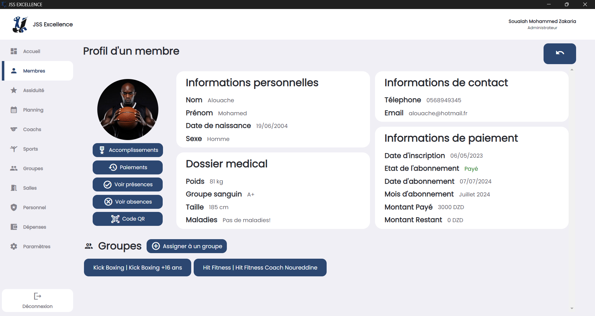

## Overview

This repository contains the Integrated Management System for the Sports Club JSS EXCELLENCE Saoula, a project developed as part of a multidisciplinary course in the second year of preparatory classes (2CP) at the Higher National School of Computer Science.

## Features

- **Authentication Page**: Secure login for users.
- **Dashboard Pages**: Comprehensive overview of club activities and performance.
- **Members Page**: Manage member information and profiles.
- **Member Details**: Detailed view of individual member profiles.
- **Schedule and Timeslots Page**: Organize and view schedules, timeslots and events.
- **Payments**: Handle member payments.
- **Member Presences**: Record member presences.
- **Member Absences**: Track member absences.
- **Achievements**: Record and display member accomplishments.
- **Coaches**: Manage coach information and profiles.
- **Expenses**: Track club expenses.
- **Rooms**: Manage club rooms and facilities.
- **Sports**: Manage different sports offered by the club.
- **Groups**: Manage groups of the different sports within the club.
- **Staff**: Manage club personnel.
- **Settings**: Configure system settings.

## Technologies Used

Electron, Express, React, HTML, CSS and MySQL.

## Contributions

This repository represents my contributions to the project. The project was a collaborative effort with SOUALAH MOHAMMED ZAKARIA.

## License

This project is licensed under the MIT License. See the [LICENSE](LICENSE) file for details.

